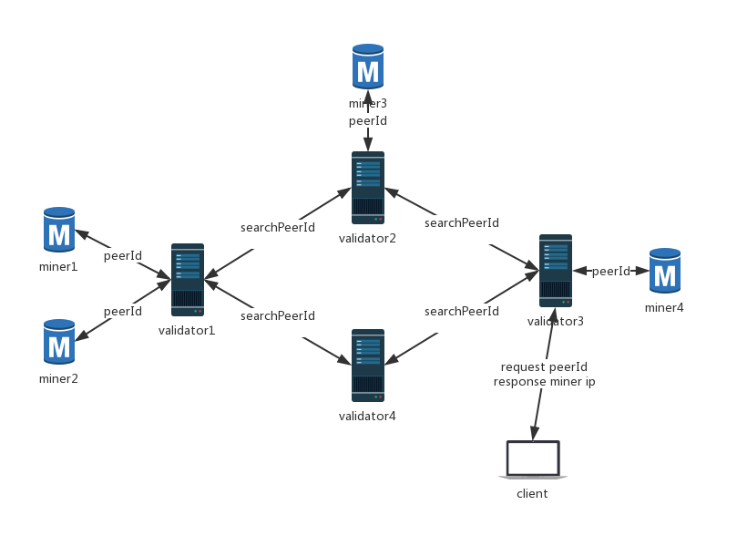

# Lambda peerId 寻址说明文档

* [validator](#validator)
* [miner](#miner)
* [一个完整的流程](#一个完整的流程)

## validator
validator作为链上的节点，当矿工节点质押在某一validator矿池下，双方建立p2p通信，在validator网络列表中记录此矿工的节点信息（包括peerId和Ip等信息），作为以后寻址的前提。

## miner
1. miner作为存储用户上传数据的角色，必须拥有公网的ip（可以不固定）。矿工节点启动后，与所指定的validator建立p2p网络通信，同时启动lambda storage存储服务，接收用户存储的文件。
2. miner同时也是用户（client）的角色，可以上传文件，上传的文件会经过交易市场的匹配，存储到合适矿工的机器上。

## 一个完整的流程
1. 用户发起一笔订单，匹配市场找到合适的卖单与之匹配，获得此卖单对应矿工的信息（peerId等）。
2. 用户拿到矿工的peerId之后会给validator发起一个查询请求，validator的p2p节点关系中如果有此peerId的连接信息，则返回peerId对应的Ip地址，如果没有则会发起一个广播消息，查询此peerId对应的Ip地址，如果网络中其他节点有此peerId，返回其对应的Ip地址。
3. 用户查询到peerId对应的Ip地址后，与miner建立连接将文件数据上传给miner。

